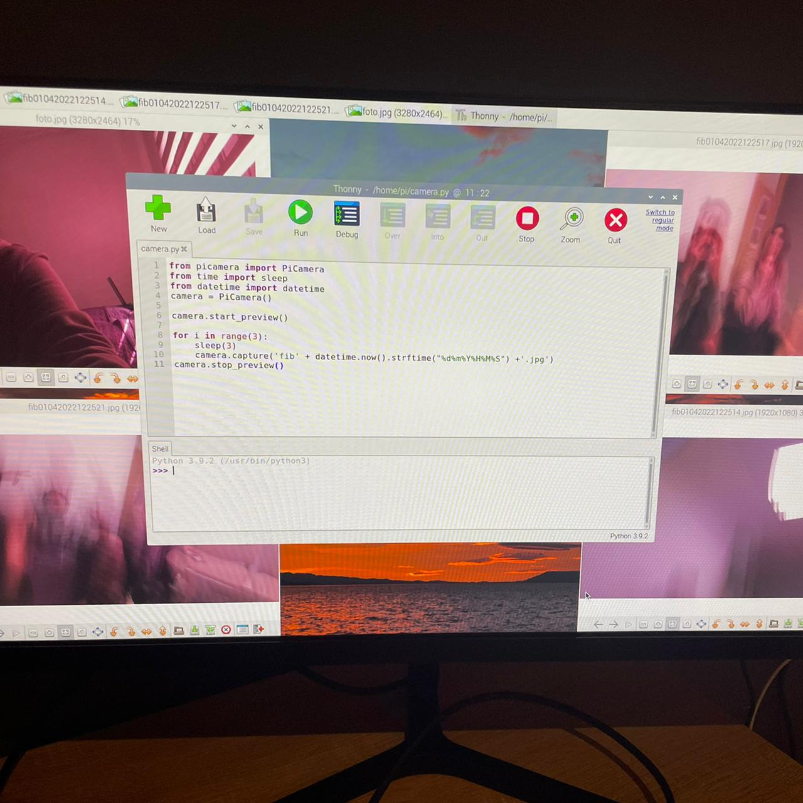
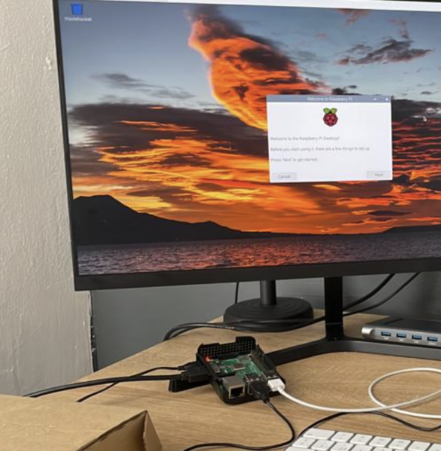

# Proyecto: Módulo de Cámara Raspberry Pi
## Curso: Proyecto Integrador Plataformas TI

El proyecto busca que se puedan reconocer los objetos detectados por la cámara conectada al Raspberry Pi. 

>Lo ideal seria crear un robot con la capacidad de moverse y esquivar objetos en su camino.

### Integrantes

* Joaquín Aravena O’Brien
* Josefina Figueroa Ubilla
* Cristian Galleguillos Araya

### Bitácora

[Ver Bitácora](docs/BITACORA.md)

### Resumen

#### Semana 1
- Se entendió el funcionamiento básico de la Raspberry Pi y se hizo funcionar en conjunto con el modulo de cámara.

    

    

#### Semana 2
- TBD
    
 

### Documentos

* [Reporte Técnico - Semana 1](docs/README.md)

